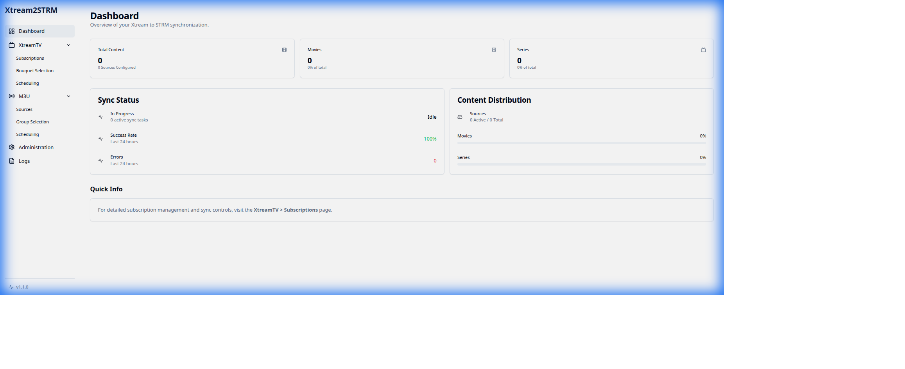
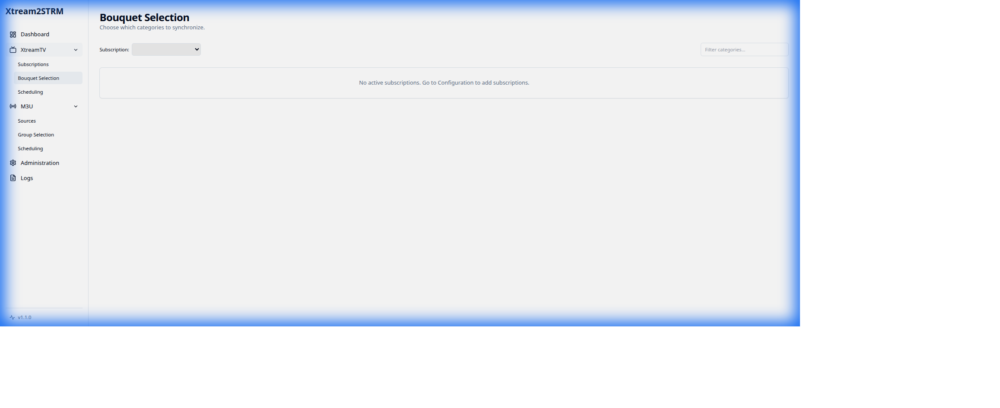
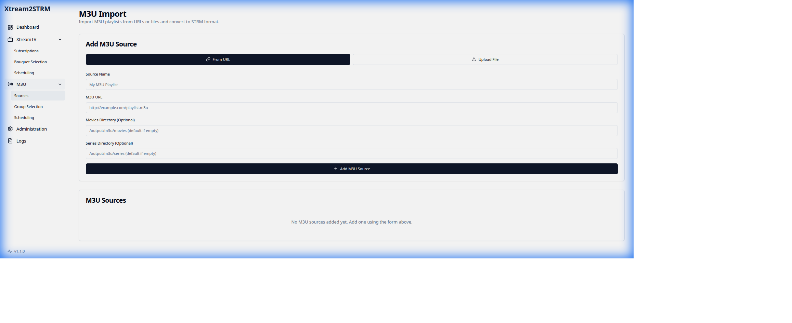
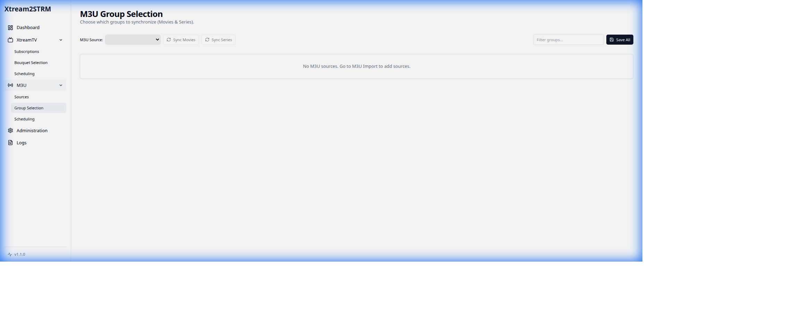
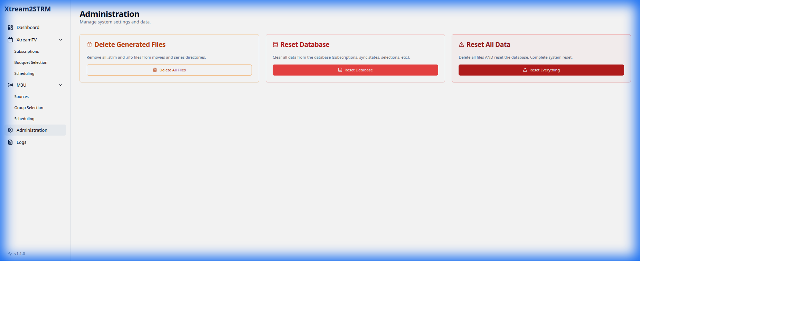

# Xtream to STRM Web

A modern, full-featured web application for managing Xtream Codes and M3U playlist content, generating `.strm` and `.nfo` files compatible with Jellyfin and Kodi.

[](https://opensource.org/licenses/MIT)
[](https://www.docker.com/)
[](https://www.python.org/)
[](https://reactjs.org/)

## 📋 Table of Contents

- [Features](#-features)
- [Screenshots](#-screenshots)
- [Architecture](#-architecture)
- [Installation](#-installation)
- [Usage](#-usage)
- [Configuration](#-configuration)
- [API Documentation](#-api-documentation)
- [Development](#-development)
- [Contributing](#-contributing)
- [License](#-license)

## ✨ Features

### Xtream Codes Support
- **Multi-Subscription Management**: Manage multiple Xtream Codes subscriptions simultaneously
- **Selective Bouquet Synchronization**: Choose which categories to sync for movies and series
- **Intelligent Caching**: Efficient caching system to minimize API calls
- **Incremental Updates**: Only sync changes since last update
- **Rich Metadata**: Generates detailed NFO files with TMDB integration
- **Episode Management**: Full support for TV series with season/episode structure

### M3U Playlist Support
- **Flexible Source Management**: Support for both URL-based and file upload M3U playlists
- **Group-Based Selection**: Select specific groups/categories to sync
- **Type-Specific Sync**: Separate synchronization for Movies and Series
- **Automatic Parsing**: Intelligent M3U parser with metadata extraction
- **No Live TV**: Focus on VOD content (Movies and Series only)

### Modern Web Interface
- **Responsive Dashboard**: Real-time statistics and sync status monitoring
- **Intuitive Navigation**: Clean, organized menu structure
- **Dark Mode Support**: Beautiful dark theme for comfortable viewing
- **Real-Time Updates**: Live sync progress and status updates
- **Error Handling**: Clear error messages and recovery options

### System Management
- **Comprehensive Administration**: Database and file management tools
- **Data Cleanup**: Easy reset and cleanup operations
- **System Health**: Monitor sync status, errors, and success rates
- **Source Statistics**: Detailed breakdown of content by source

## 📸 Screenshots

### Dashboard

*Overview of all your content with real-time statistics*

### XtreamTV Bouquet Selection

*Select which categories to sync from your Xtream Codes subscription*

### M3U Sources Management

*Manage your M3U playlist sources with URL or file upload*

### M3U Group Selection

*Choose which groups to sync with separate Movies and Series controls*

### Administration

*System administration with cleanup and reset tools*

## 🏗️ Architecture

### Technology Stack

**Backend:**
- **FastAPI**: Modern, fast web framework for building APIs
- **SQLAlchemy**: SQL toolkit and ORM
- **Celery**: Distributed task queue for background jobs
- **Redis**: In-memory data store for caching and task queue
- **Python 3.11**: Latest Python with improved performance

**Frontend:**
- **React 18**: Modern React with hooks and concurrent features
- **TypeScript**: Type-safe JavaScript
- **Vite**: Next-generation frontend tooling
- **TailwindCSS**: Utility-first CSS framework
- **Shadcn/ui**: Beautiful, accessible component library

**Infrastructure:**
- **Docker**: Containerization for easy deployment
- **Docker Compose**: Multi-container orchestration
- **SQLite**: Lightweight, embedded database
- **Uvicorn**: Lightning-fast ASGI server

### Project Structure

```
xtream_to_strm_web/
├── backend/
│   ├── app/
│   │   ├── api/              # API endpoints
│   │   │   └── endpoints/    # Route handlers
│   │   ├── core/             # Core configuration
│   │   ├── db/               # Database setup
│   │   ├── models/           # SQLAlchemy models
│   │   ├── services/         # Business logic
│   │   └── tasks/            # Celery tasks
│   └── requirements.txt
├── frontend/
│   ├── src/
│   │   ├── components/       # Reusable components
│   │   ├── lib/              # Utilities
│   │   └── pages/            # Page components
│   └── package.json
├── docker-compose.yml
├── Dockerfile.single
└── README.md
```

## 🚀 Installation

### Prerequisites

- Docker and Docker Compose
- Git

### Quick Start

1. **Clone the repository:**
   ```bash
   git clone https://github.com/yourusername/xtream_to_strm_web.git
   cd xtream_to_strm_web
   ```

2. **Build and start the application:**
   ```bash
   docker-compose up -d --build
   ```

3. **Access the web interface:**
   Open your browser and navigate to `http://localhost`

4. **Stop the application:**
   ```bash
   docker-compose down
   ```

### Manual Installation (Development)

<details>
<summary>Click to expand manual installation instructions</summary>

**Backend:**
```bash
cd backend
python -m venv venv
source venv/bin/activate  # On Windows: venv\Scripts\activate
pip install -r requirements.txt
uvicorn app.main:app --reload
```

**Frontend:**
```bash
cd frontend
npm install
npm run dev
```

**Redis (required for Celery):**
```bash
docker run -d -p 6379:6379 redis:alpine
```

**Celery Worker:**
```bash
cd backend
celery -A app.core.celery_app worker --loglevel=info
```

</details>

## 📖 Usage

### Adding an Xtream Codes Subscription

1. Navigate to **XtreamTV** → **Subscriptions**
2. Click **Add Subscription**
3. Enter your subscription details:
   - Name
   - Xtream URL
   - Username
   - Password
   - Output directories for movies and series
4. Click **Save**

### Selecting Bouquets to Sync

1. Navigate to **XtreamTV** → **Bouquet Selection**
2. Click **List Categories** to fetch available categories
3. Select the categories you want to sync for:
   - Movies
   - Series
4. Click **Save Selections**
5. Use **Sync Movies** or **Sync Series** to start synchronization

### Adding an M3U Source

1. Navigate to **M3U Import** → **Sources**
2. Choose one of two methods:
   - **URL**: Enter an M3U playlist URL
   - **File Upload**: Upload an M3U file
3. Configure the output directory
4. Click **Add Source**

### Syncing M3U Content

1. Navigate to **M3U Import** → **Group Selection**
2. Select your M3U source from the dropdown
3. Select the groups you want to sync for:
   - Movies
   - Series
4. Click **Save Groups**
5. Use **Sync Movies** or **Sync Series** to generate .strm files

### Generated File Structure

**Movies:**
```
/output/movies/
└── Movie Name (Year)/
    ├── Movie Name (Year).strm
    └── Movie Name (Year).nfo
```

**Series:**
```
/output/series/
└── Series Name/
    ├── Season 01/
    │   ├── Series Name S01E01.strm
    │   ├── Series Name S01E01.nfo
    │   └── ...
    ├── Season 02/
    │   └── ...
    └── tvshow.nfo
```

## ⚙️ Configuration

### Environment Variables

The application uses the following configuration (defined in `backend/app/core/config.py`):

```python
API_V1_STR = "/api/v1"          # API prefix
PROJECT_NAME = "Xtream to STRM"  # Application name
OUTPUT_DIR = "/output"           # Default output directory
```

### Docker Volumes

The Docker setup mounts the following volumes:

```yaml
volumes:
  - ./output:/output          # Generated .strm files
  - ./data:/app/data          # SQLite database
```

## 📚 API Documentation

The API documentation is automatically generated and available at:
- **Swagger UI**: `http://localhost/api/v1/docs`
- **ReDoc**: `http://localhost/api/v1/redoc`

### Main Endpoints

**Dashboard:**
- `GET /api/v1/dashboard/stats` - Get overall statistics
- `GET /api/v1/dashboard/recent-activity` - Get recent sync activity
- `GET /api/v1/dashboard/content-by-source` - Get content breakdown by source

**XtreamTV:**
- `GET /api/v1/subscriptions/` - List all subscriptions
- `POST /api/v1/subscriptions/` - Add a new subscription
- `POST /api/v1/selection/{subscription_id}/sync` - Sync selected categories

**M3U:**
- `GET /api/v1/m3u-sources/` - List all M3U sources
- `POST /api/v1/m3u-sources/` - Add a new M3U source
- `POST /api/v1/m3u-selection/{source_id}/sync` - Sync selected groups

**Administration:**
- `POST /api/v1/admin/delete-files` - Delete all generated files
- `POST /api/v1/admin/reset-database` - Reset database
- `POST /api/v1/admin/reset-all` - Delete files and reset database

## 🛠️ Development

### Running Tests

```bash
# Backend tests
cd backend
pytest

# Frontend tests
cd frontend
npm test
```

### Code Style

**Backend:**
```bash
# Format with black
black app/

# Lint with flake8
flake8 app/
```

**Frontend:**
```bash
# Lint
npm run lint

# Format
npm run format
```

### Building for Production

```bash
docker-compose -f docker-compose.yml build
docker-compose -f docker-compose.yml up -d
```

## 🤝 Contributing

Contributions are welcome! Please feel free to submit a Pull Request.

1. Fork the repository
2. Create your feature branch (`git checkout -b feature/AmazingFeature`)
3. Commit your changes (`git commit -m 'Add some AmazingFeature'`)
4. Push to the branch (`git push origin feature/AmazingFeature`)
5. Open a Pull Request

## 📝 License

This project is licensed under the MIT License - see the [LICENSE](LICENSE) file for details.

## 🙏 Acknowledgments

- Thanks to all contributors who have helped with this project
- Inspired by the need for a modern web interface for Xtream Codes management
- Built with love for the Jellyfin and Kodi community

## 📞 Support

If you encounter any issues or have questions, please:
1. Check the [Issues](https://github.com/yourusername/xtream_to_strm_web/issues) page
2. Create a new issue if your problem isn't already listed
3. Provide as much detail as possible, including logs and screenshots

## 🔄 Changelog

### Version 2.0.0 (Current)
- ✨ Added M3U playlist support
- ✨ Refactored UI with separate XtreamTV and M3U sections
- ✨ Removed Live TV functionality (focus on VOD only)
- ✨ Split sync controls for Movies and Series
- 🐛 Fixed dashboard statistics calculations
- 🐛 Improved error handling and user feedback
- 🎨 Enhanced UI/UX with better navigation
- 📚 Comprehensive documentation

### Version 1.0.0
- 🎉 Initial release
- ✨ Xtream Codes support
- ✨ Basic web interface
- ✨ STRM and NFO file generation

---

Made with ❤️ by the community
